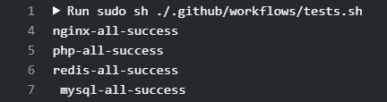

# docker-phper

docker 一键部署php开发者环境

### 特性

1. 真 · 一键部署
2. 清晰配置与日志文件
3. 数据持久化
4. 自定义php扩展

### 项目结构

```
│   .env    系统配置
│   docker-compose.yml
├───.github
│   └───workflows
│           tests.sh  自动测试脚本
├───bin
│   ├───nginx
│   └───php
│       └───7.1.31
│           └───extensions   php扩展
│               │   gd.sh    扩展安装脚本
│               └───etc  php扩展包
├───config  配置目录
│   ├───mysql
│   ├───nginx
│   ├───php
│   └───redis
├───data  数据目录
│   ├───mysql
│   ├───rabbitmq
│   └───redis
├───logs	日志目录
│   ├───nginx
│   ├───php
│   ├───rabbitmq
│   └───redis
│
└───www  web目录
    └───localhost
        └───dp	测试程序
```

### 开发流程

* [x] php7.2
* [x] mysql
* [x] nginx
* [x] redis
* [x] 自动测试
* [ ] rabbitmq
* [ ] php7.3
* [ ] phpmyadmin
* [ ] 待定....

### 安装使用

#### 环境要求

> docker
>
> docker-compose

#### 安装

1. 下载

   ```
   git clone https://github.com/hellowzsg/docker-phper.git && cd docker-phper
   ```

2. 启动

   ```
   docker-compose up -d php nginx mysql redis
   ```

   > 这里只启用 php,mysql,nginx,mysql,redis
   >
   > 家庭宽带在构建php镜像的时候可能会有网络问题，可能需要代理

3. 测试

   ```
   sh ./.github/workflows/tests.sh
   ```

   

4. star...

### PHP扩展

参考https://github.com/mlocati/docker-php-extension-installer?tab=readme-ov-file#supported-php-extensions